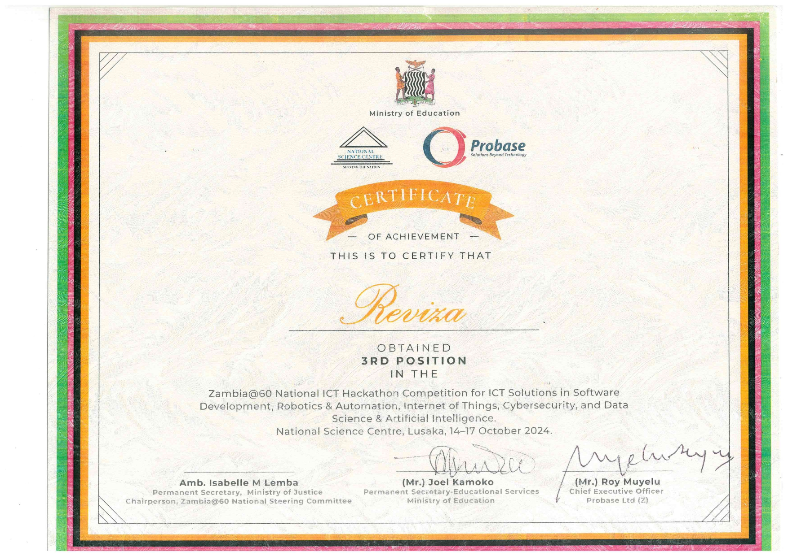

Over the past few weeks, we competed in three intense rounds against 89 of the country's brightest innovators and emerged with a victory. I've always had a passion for public speaking, but this experience pushed me beyond what I thought I could accomplish.

<!-- truncate -->

The theme, “60 Years Strong: Honouring our Heritage, Embracing our Future,” was both relevant and inspiring. While Zambia has made significant advancements in technology since gaining independence, there is still much more to do to keep pace with the rest of the world. Before one of the rounds, the Director of the National Science Council spoke to us about the importance of sustainability. He emphasized that we shouldn't just create innovations to win competitions but also work toward making them a reality.

Our app, ReviZa, is a platform designed to revolutionize access to quality study materials in Zambian universities. Keep an eye out for it when it becomes available on your app store!

I am incredibly grateful to my teammates, Kanyanta Makasa, and Kangwa Mukuka, for their unwavering support throughout this journey. The late nights spent refining our pitch truly paid off. I would also like to extend my sincere thanks to all the cooperating partners who made this event possible.🙌

