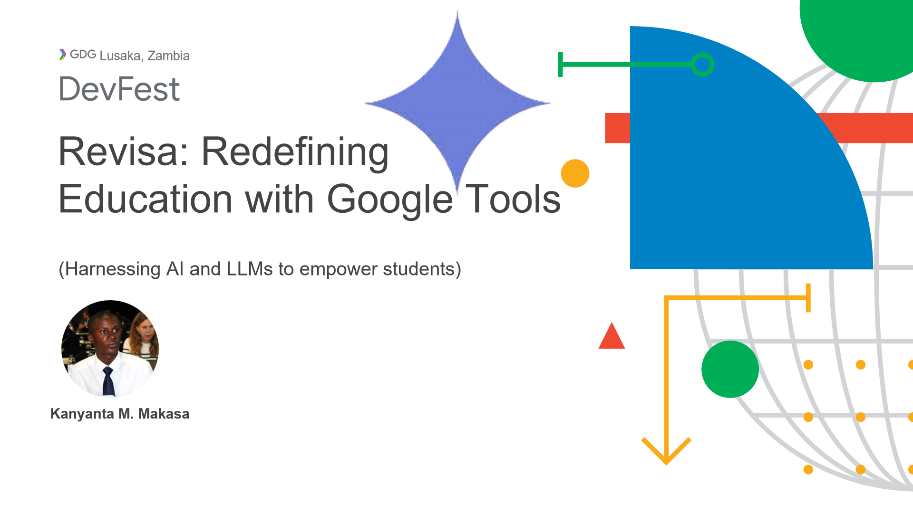
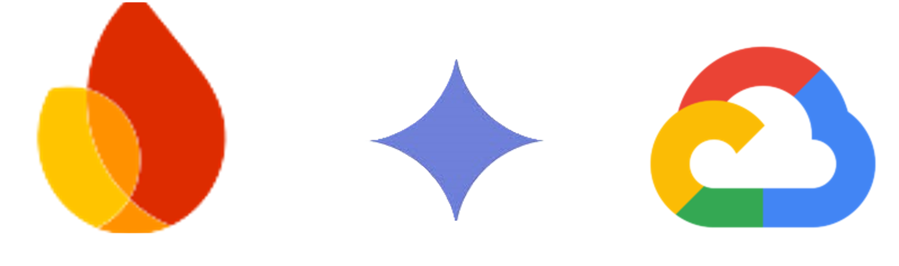
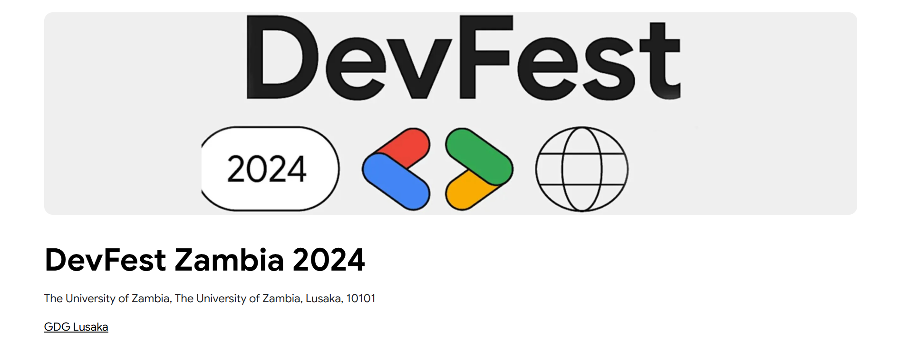

Education is undergoing a massive transformation, and ReviZa is at the forefront of this change. At GDG DevFest 2024 in Lusaka, Zambia, we unveiled our vision to empower students through cutting-edge AI and advanced tools built on Google’s tech stack. ReviZa is more than just an app—it's a mission to redefine education.

<!-- truncate -->

## The Challenges in Education Today

In the current academic landscape, students face significant hurdles:

- **Lack of Personalized Study Resources**: Every learner is unique, yet educational resources are often generic.
- **Scattered and Unstructured Academic Material**: Finding the right information is a daunting task, slowing down learning progress.
- **Impersonal Feedback Systems**: Traditional learning systems fail to provide timely and relevant feedback, leaving students feeling disconnected.

These challenges inspired us to create **ReviZa**, a platform designed to bridge these gaps.

## What is ReviZa?

ReviZa is a groundbreaking platform that empowers students with tools to:

- **Share Academic Material**: Foster collaboration by making study materials accessible to everyone.
- **Access Personalized Study Recommendations**: Tailor learning resources to individual needs using the power of AI.
- **Generate Context-Aware Questions for Exam Prep**: Simplify the study process with auto-generated, targeted questions.

ReviZa’s core functionality revolves around analyzing the materials students interact with and delivering tailored insights—an experience that feels personal, yet scalable.

## How It Works

ReviZa leverages Google’s tech stack for a seamless user experience:

1. **Gemini**: A generative large language model, Gemini creates personalized study content, quizzes, and explanations tailored to individual learning needs.
2. **Firebase**: This backend powerhouse provides real-time data syncing, secure authentication, and cloud storage, enabling effortless collaboration and resource sharing.
3. **Flutter**: Our cross-platform app development framework ensures high performance and a consistent experience across mobile, web, and desktop platforms.

## The Future of ReviZa

ReviZa’s journey is just beginning. Here are some of the exciting developments on the horizon:

- **A Comprehensive Academic Data Bank**: We’re building a vast repository of educational content stored on Firebase for easy access.
- **Hyper-Personalized AI Learning**: With Gemini, ReviZa will adjust uniquely to each user, offering even more tailored study experiences.
- **Video Content Generation**: Leveraging Google Cloud and advanced AI techniques, we aim to create personalized educational videos for students worldwide.

These innovations will ensure that ReviZa continues to meet the evolving needs of students and educators.

## Why ReviZa Matters

By addressing the core challenges in education, ReviZa has the potential to:

- Democratize access to high-quality study materials.
- Accelerate learning for students in Zambia and beyond.
- Revolutionize how academic feedback and study recommendations are delivered.

At its heart, ReviZa is about empowering learners to achieve their fullest potential.

## Join the Movement

We’re excited to bring ReviZa to students worldwide, but we can’t do it alone. If you’re passionate about transforming education or want to support our mission, reach out to us. Together, we can redefine learning for generations to come.

### Thank You

We’re incredibly grateful for the opportunity to share ReviZa’s story at GDG DevFest 2024. A special thanks to the developers, educators, and students who continue to inspire us every day.

**Let’s reshape the future of education—one student at a time.**

### Questions or Ideas?

We’d love to hear from you! Drop us a comment below or connect with us on [LinkedIn](https://linkedin.com/in/kanyantamakasa) or [GitHub](https://github.com/KanyantaM).
